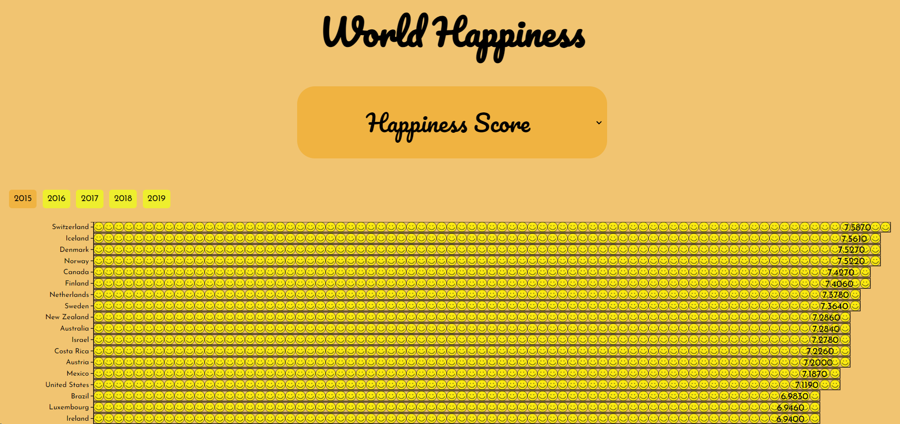

<h1>World Happiness</h1> 

Welcome to my repository of World Happiness. This is a datavisualisation build in a 6-week study program for the minor Information Design in the third year of the bachelor: Communication and Multimedia Design at HvA.

<h2>What is this datavisualisation about?</h2>

 
The World Happiness data visualisation is about Happiness. It's about which countries in the world are the happiest. This concerns five years (2015, 2016, 2017, 2018, 2019) and therefore five datasets. The general Happiness Score is shown and this depends on a few factors: Family, Freedom and Health (Life Expectancy). The user can see all the different factors/options and the five years in which the factors change. 

The factors are shown in a dropdown menu. The user can select which one they want to see in the chart. When the user clicks on one of them, the data for that factor is shown. 

The years are shown as filters (buttons). The user can select a year and then the year will become a different color, so the user knows which data from which year he is seeing. There are five years to choose from and all of them can show data from the factors. 

The application is build for desktop screens. The reason for this is that it is a long chart and it needs a lot of space along it's length.

<h2>Build with...</h2>

<ul>
    <li>git</li>
    <li>Sveltekit</li>
    <li>d3.js</li>
    <li>Deployment: Vercel</li>
</ul>

<h2>CSV to Json Converter</h2>

I've used this link to convert CSV to Json, so that I can work with Json in JavaScript and Svelte: https://csvjson.com/csv2json

<h2>Installation guide</h2>

<h3>Node</h3>

Install node.js

<b>-- node install</b>

or check if it's installed already by running the following code

<b>-- node version</b>

<h3>Clone repository</h3>

Clone repository by this link: https://github.com/DonnaBaijens/tech-track-23-24 with the following command:

<b>-- git clone https://github.com/DonnaBaijens/tech-track-23-24.git </b>

After that, run the following code to install all the dependencies

<b>-- npm install</b>

Check if it works by running the application

<b>npm run dev</b>

Open the link provided in the terminal for your localhost and you should be able to see the application.

<h3>What it should look like</h3>

<h2>License</h2>

2023 Donna Baijens MIT

